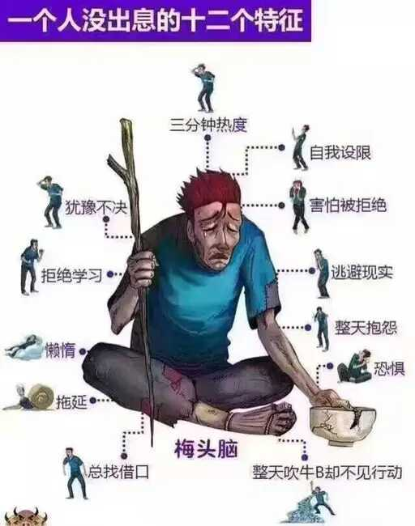

## 人过三十，有些事你要学会承担

一、 一个叫“梅头脑”的人，右手持着一根枯木，另一只手拿着一只破碗，身上看上去脏兮兮的，就连那身上的衣服，也像是经历了几世沧桑，显得是如此的破烂不堪。脚上穿着的是鞋？我已经无法分辨了。在他的四周是几个刺眼的字，不是因为字本身刺眼，而是它们承载着的内容让你有些不知所措了。三分钟热度、自我设限、害怕被拒绝、逃避现实、整天抱怨、犹豫不绝、拒绝学习、整天吹牛B却不见行动、总找借口、拖延、懒惰、恐惧，每一个字仿佛在自己的身上都能找到影子。你看着是不是很熟悉？在看看那个人，面如枯槁，眼角挂着几滴泪水，是不是就是几年、几十年，甚至就是现在的自己？一个没有出息的人，一个没有任何行动力的人。

你选择逃避现实，现实终将会给你一记响亮的耳光！

二、 朋友小A借钱，说妈妈得了尿毒症，自己在老家已经做了很长时间的透析手术了，父母却从未敢告诉小A实情。现在医院通知已经找到了合适的肾源，但是需要支付二三十万的费用，爸爸实在是没有了办法，才向小A道出了实情，问问已经工作了七八年的小A，手里是否有点儿积蓄。

父母不到万不得己之时，是不会向儿女要钱的。他们为儿女操劳忙碌了一辈子，到老了，心里也还是惦念着自己的孩子。他们害怕生病，更怕成为孩子的累赘。

你会借给小A钱吗？能借多少呢？有个小A的同学小C给她打了五万块。从另一个朋友口中得知，小C并没有把钱要回来的意思，他说：“在情感上，我特写想借她十万八万，但理智上我担心她十年八年也还不了这个钱。我也不富裕，还在这些年一直折腾着学习、跳槽，工资越来越高，家人万一有病有灾，经济上足够抵挡一阵子。这五万块，我也是不打算要回来了。”

老话说“救急不救穷”。又急又穷，是很难借到钱的。

三、 在人生的每一个阶段，允许你偶尔的肆意放纵，肆无忌惮，但是在人生的生命长河中，每一个阶段都需要我们咬紧牙关步步紧跟。不然一连串都人生问题来了，我们又将如何选择？

被追问的人生太过被动。既然鸡飞狗跳的阶段迟早会到来，我们何不早早努力，做好迎接的准备？

我们不努力，他们怎么办？

－－－－以上内容摘自[我们不努力，他们怎么办](https://mp.weixin.qq.com/s?__biz=MjM5NTE2NTUyMA==&mid=2652487956&idx=1&sn=7fc7f05fbd75443a4f593460085275bd&scene=1&srcid=07306eIH4cXXkzYabHqqXMJf&key=8dcebf9e179c9f3a5733ab0735e65458498e2f4a6da4d91377534ac1eb4e6f4719efd926eb4167580ed434077e52cd3c&ascene=0&uin=MTI1Njc2MzgyMQ%3D%3D&devicetype=iMac+MacBookPro11%2C1+OSX+OSX+10.9.5+build(13F34)&version=11020012&pass_ticket=YVAgHqfglrkzBLrLFSV5eVTYXFWlN9ewdN4YpVdBhldVodSjc7v2HBV1JEcgN%2BSt)，有删减。